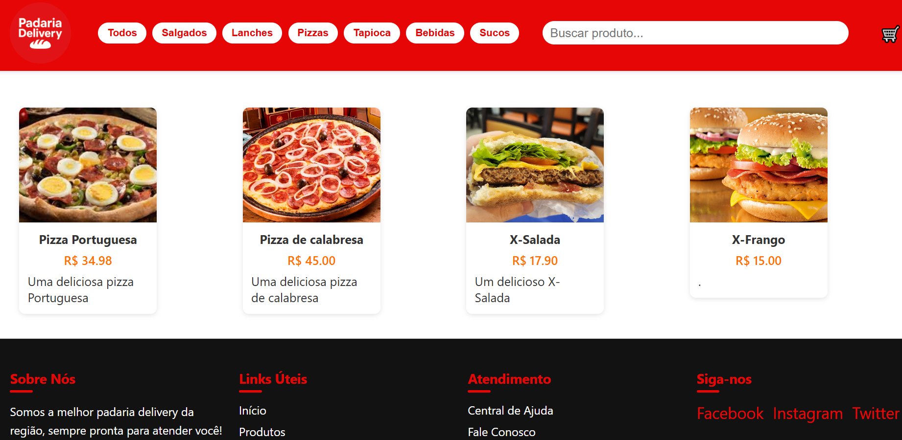

🍔 Lanchonete Lanches da LJ - Documentação
📦 Projeto
Sistema completo de pedidos online com painel administrativo, visualização de produtos, carrinho, envio por WhatsApp, e gestão via Firebase.

👨‍💼 Painel Administrativo (admin.html)
🔐 Login
Acesso com senha de administrador.

A senha padrão pode ser alterada no código da função verificarLogin() no arquivo script-admin.js.

🧭 Navegação
Menu lateral com abas:

Cadastrar Produto

Produtos

Pedidos

Finalizados

Modo Escuro

Sair

📥 Cadastro de Produto
Campos obrigatórios:

Nome

Preço

Categoria (ex: Lanches, Pizzas, Bebidas)

Descrição

Imagem

🔄 Suporta edição de produto já cadastrado.

📦 Aba "Produtos"
Lista todos os produtos, ativos e inativos.

Permite:

Editar

Excluir

Ativar/Desativar

Campo de busca por nome ou categoria.

🛒 Aba "Pedidos"
Lista pedidos não entregues.

Mostra:

Cliente, endereço, WhatsApp

Itens, taxa de entrega e total

Botões de ação:

Em preparo

Saiu para entrega

Finalizar

Enviar mensagem pelo WhatsApp

✅ Aba "Finalizados"
Exibe pedidos com status "Entregue".

Apenas visualização.

👨‍🍳 Funcionalidades Técnicas
🔥 Integração Firebase (Firestore)

☁️ Upload de imagens via ImgBB API

🌑 Modo escuro no painel

🧠 Armazenamento local de login com localStorage

📦 Produtos com status ativo: true | false

📱 Design responsivo

👨‍👩‍👧‍👦 Site do Cliente (index.html)
🛍️ Visualização de Produtos
Lista todos os produtos ativos

Filtragem por categoria

Informações: nome, descrição, preço e imagem

🛒 Carrinho
Cliente adiciona produtos ao carrinho

Define quantidade por item

Campo para observações e nome do cliente

📲 Finalização de Pedido
Botão "Enviar por WhatsApp"

Envia os itens + total + nome do cliente

Integração automática com WhatsApp Web ou App

🧑‍💻 Tecnologias Utilizadas
HTML5, CSS3, JavaScript (puro)

Firebase Firestore (Banco de Dados)

Firebase Auth (opcional)

ImgBB (upload de imagens)

WhatsApp Web API

Design responsivo com CSS Grid/Flexbox

🛠️ Como Executar o Projeto
🔧 Admin
Abrir o arquivo admin.html

Inserir a senha correta

Gerenciar produtos e pedidos

📱 Cliente
Abrir index.html

Adicionar produtos ao carrinho

Finalizar pedido via WhatsApp